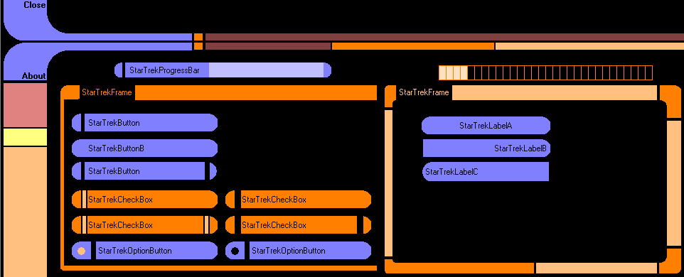



## a1\_StarTrek ControlsSet

### Description

it's one of my first controls, created before year or more. cool designed but can be better coded.

maybe I use some time and create new collection.

Download and try it. It's smal ZIP but there are 5 or more controls

(progressbar, buttons, check box, frame...)

If you like it please vote! Thanks!
 
### More Info
 

             |
---                |---
**Submitted On**   |2005-07-15 20:40:44
**By**             |[ivan stimac](https://github.com/Planet-Source-Code/PSCIndex/blob/master/ByAuthor/ivan-stimac.md)
**Level**          |Beginner
**User Rating**    |4.3 (13 globes from 3 users)
**Compatibility**  |VB 6\.0
**Category**       |[OLE/ COM/ DCOM/ Active\-X](https://github.com/Planet-Source-Code/PSCIndex/blob/master/ByCategory/ole-com-dcom-active-x__1-29.md)
**World**          |[Visual Basic](https://github.com/Planet-Source-Code/PSCIndex/blob/master/ByWorld/visual-basic.md)
**Archive File**   |[a1\_StarTre2008517242006\.zip](https://github.com/Planet-Source-Code/ivan-stimac-a1-startrek-controlsset__1-66066/archive/master.zip)

